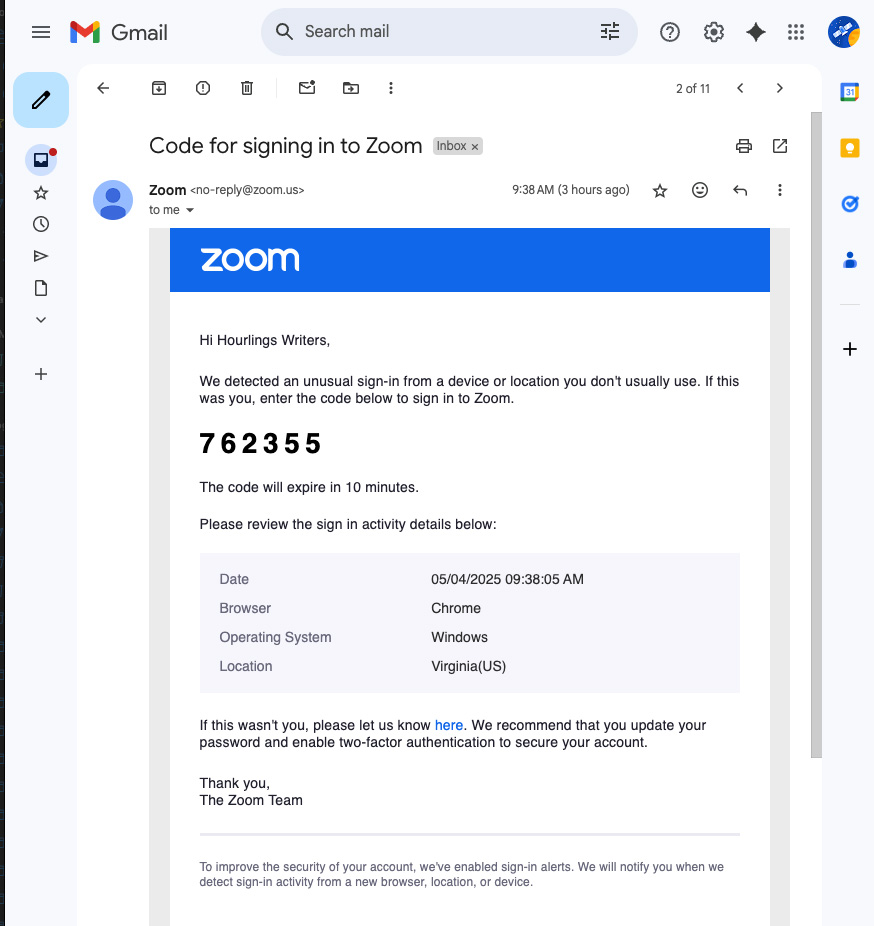

# Hourlings Writers: Gmail & Zoom Login Guide

## Table of Contents

- [Overview](#overview)
- [Gmail Login Instructions](#gmail-login-instructions)
  - [Get A Code From An Admin](#get-a-code-from-an-admin)
  - [Login into Chrome as hourlingswriters@gmail.com](#login-into-chrome-as-hourlingswritersgmailcom)
- [Zoom Login Instructions](#zoom-login-instructions)
  - [Managing Zoom Meetings](#managing-zoom-meetings)
  - [Starting a Meeting as Host](#starting-a-meeting-as-host)
  - [Transferring Host Role](#transferring-host-role)
  - [Enabling Screen Sharing for All Participants](#enabling-screen-sharing-for-all-participants)
  - [Managing Recurring Meetings](#managing-recurring-meetings)
- [Best Practices & Troubleshooting](#best-practices--troubleshooting)
  - [Login Security Alerts](#login-security-alerts)
  - [Managing Multiple Accounts](#managing-multiple-accounts)
  - [Testing Before Meetings](#testing-before-meetings)
  - [Hosting Responsibilities](#hosting-responsibilities)
  - [Connection Issues](#connection-issues)
- [Contact Information: Admins/Host List](#contact-information-adminshost-list)
- [Resources](#resources)
  - [Zoom Help Center](#zoom-help-center)
  - [Gmail Help](#gmail-help)
  - [Hourlings Writers Group Resources](#hourlings-writers-group-resources)

## Overview

The Hourlings Writers group uses a shared Gmail account and Zoom Pro subscription to facilitate online meetings. This document outlines the login process and getting started related account signin procedures for any member who wants to help out and be a zoom host. _This is all volunteer and not required to for participation in the Hourlings._

For anyone hosting the Zoom meeting if a regular host is not available, this guide explains how to access these accounts and manage your Zoom sessions. To get the passwords for each account, please contact Liz. And please do not share these account credentials with anyone, ever.

If you plan on ever hosting, please have all of the login steps completed before the meeting to avoid any problems eating into the meeting

### Account Information

- **Gmail Account**: hourlingswriters@gmail.com
- **Gmail Password**: _contact Liz (on facebook or ehayes@cox.net)_
- **Zoom Account**: hourlingswriters@gmail.com
- **Zoom Password**: _contact Liz (on facebook or ehayes@cox.net)_

## Gmail Login Instructions

The first time you try to sign in to Zoom with the hourlingswriters@gmail.com account, you may need to retrieve a one-time passcode from the Gmail account. There are two ways to do this:

1. Have a current admin/host aid you (preferred)
2. Login in to Chrome with the hourlings

### Get A Code From An Admin

Select a contact from the list [here](#contact-information-adminshost-list) and coordinate a time you will try to sign into Zoom. There is a 10 min window in which the code is active and in most cases, sign in should take no more than a few minutes.

            Place images of sign in attempt here:

            Place image of required passcode here:

### Login into Chrome as hourlingswriters@gmail.com

1. Go to [gmail.com](https://gmail.com)
2. Enter the email address: `hourlingswriters@gmail.com`
3. Enter the password: _contact Liz (on facebook or ehayes@cox.net)_
4. If prompted for verification, use the options provided to verify the account

Once logged into Gmail, you'll be able to access any one-time passcodes that Zoom sends for verification purposes. These passcodes typically arrive immediately but expire after 10 minutes.

_Note: When you receive security alerts about someone signing into the account, this is normal as multiple people use these shared credentials._

## Zoom Login Instructions

To access the Hourlings Writers Zoom account:

1. Go to [zoom.us](https://zoom.us)
2. Click "Sign In" in the top-right corner
3. Enter the email address: `hourlingswriters@gmail.com`
4. Enter the password: _contact Liz (on facebook or ehayes@cox.net)_
5. If prompted for a one-time passcode:
   - Check the hourlingswriters@gmail.com inbox for the code
   - Enter the code within 10 minutes of receipt
   - If the code expires, request a new one

### Managing Zoom Meetings

#### Starting a Meeting as Host

1. Log in to the Zoom account using the instructions above
2. Click on "Host a Meeting" from the top-right menu
3. Select "With Video On" or your preferred option
4. Follow the prompts to start the meeting

#### Transferring Host Role

If you need to leave early:

1. While in the meeting, click "Participants" at the bottom of the screen
2. Hover over the name of the person you want to make host
3. Click "More" and select "Make Host"
4. Confirm your choice

#### Enabling Screen Sharing for All Participants

1. While hosting a meeting, click the "Security" button
2. Check "Share Screen" in the menu that appears
3. All participants will now be able to share their screens without requiring host permission

#### Managing Recurring Meetings

The Sunday writers' group meeting should be set up as a recurring meeting. This means:

- The same meeting link can be used each week
- No need to create a new meeting for each session
- Anyone with the link can join

## Best Practices & Troubleshooting

### Login Security Alerts

- You may receive security alerts about logins from different locations
- This is normal for a shared account
- No action is required if you recognize the activity as group-related

### Managing Multiple Accounts

- If you're already logged into a personal Zoom account on your device, you may need to log out first
- To switch accounts:
  1. Click on your profile picture in the top-right corner
  2. Select "Sign Out"
  3. Then log in with the Hourlings credentials

### Testing Before Meetings

- Consider doing a "dry run" before important meetings
- Test features like screen sharing and recording
- Make sure you can access all necessary controls

### Hosting Responsibilities

- The first person to join the meeting typically serves as host
- If you're hosting, arrive 5-10 minutes early
- If you need to leave early, transfer host duties to another participant

### Connection Issues

If you're having trouble logging in:

1. Try clearing your browser cache
2. Ensure you're using the correct credentials
3. Check if the one-time passcode has expired (request a new one if needed)
4. Try using a different browser or the Zoom desktop application

## Contact Information: Admins/Host List

For help with installation or have questions about the Hourlings accounts:

- **Liz Hayes**: ehayes@cox.net
- **Don Anderson**: gone3d@gmail.com
- **Dave Keener**: dkeener@keenertech.com
- **Martin Wilsey**: martin.wilsey@gmail.com

## Resources

### Zoom Help Center

- [Zoom Support](https://support.zoom.us)
- [Host Controls in a Meeting](https://support.zoom.us/hc/en-us/articles/201362603-Host-and-Co-Host-Controls-in-a-Meeting)
- [Screen Sharing Guide](https://support.zoom.us/hc/en-us/articles/201362153-Sharing-your-screen-content-or-second-camera)

### Gmail Help

- [Gmail Support](https://support.google.com/mail)
- [Signing in to Gmail](https://support.google.com/mail/answer/8494?hl=en&co=GENIE.Platform%3DDesktop)

---

_Last updated: May , 2025_
